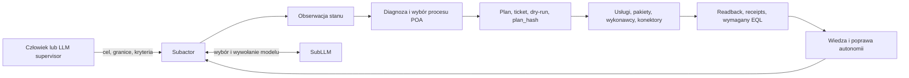

---
{
  "schema": "wellmanifest.guide/v1",
  "id": "how-to-use-subactor",
  "version": "0.5.1",
  "status": "current",
  "updated": "2026-08-29",
  "home": "wellmanifest",
  "shape": "domain_pack",
  "runtime_owner": "subactor"
}
---

# Jak używać Subactora

Normatywny przewodnik dla człowieka i LLM-a nadzorującego realizację zadań
przez Subactor za pomocą CLI/shell, REST API, interfejsu webowego, MCP i
wersjonowanych artefaktów.

Wydanie `0.5.1` rozszerza przewodnik o bezpośrednie komendy delegacji autonomii
Foundera (`subactor auto` / `delegate`), zachowanie rozmowy `subactor chat` z
typowanym DOQL oraz politykę kandydatów SubLLM z failoverem przy błędach
łączności providera.

Wydanie `0.5.0` rozdzieliło niezmienne reguły od powierzchni wykonawczych.
Kanoniczny [manifest standardu](docs/standard/manifest.v1.json) wiąże profile
przez SHA-256, a profile [Founder CLI](docs/profiles/founder-cli.v1.json),
[Subactor Shell](docs/profiles/subactor-shell.v1.json),
[refaktoryzacji C2004](docs/profiles/c2004-refactoring.v1.json) i
[rozwoju projektu](docs/profiles/project-development.v1.json) określają
konkretne operacje, poziomy władzy i wymagane dowody. To wydanie dodaje piąty
poziom władzy — ograniczoną autonomię kontraktową — oraz wymóg preflightu
gotowości przed zleceniem pracy klasy apply.

Obserwacja z 2026-08-28: Subactor ma **dwie żywe płaszczyzny wykonania**. Founder
CLI i Control prowadzą tickety organizacyjne. Koru i lokalny Planfile prowadzą
tickety konkretnego repozytorium. `subactor tickets` NIE JEST kolejką projektu.
Sekcje 5.5, 5.7 i 5.8 opisują zaobserwowany podział, a nie architekturę docelową.

> **Subactor nie jest agentem LLM.** Jest autonomicznym systemem organizacyjnym,
> któremu zleca się rezultat wraz z granicami i kryteriami dowodowymi. Rozmawiaj
> z nim tak, jak z kompetentnym operatorem złożonej maszyny: określ cel,
> uprawnienia i oczekiwany dowód, a wybór procesu i wykonanie pozostaw systemowi.

Słowa **MUSI**, **NIE WOLNO**, **POWINIEN** i **MOŻE** oznaczają odpowiednio
wymóg, zakaz, zalecenie i możliwość w ramach tej standaryzacji.

## 1. Model mentalny

Subactor stanowi ekosystem wyspecjalizowanych usług, pakietów, polityk,
rejestrów, procesów, kolejek, wykonawców, konektorów i cyfrowych bliźniaków.
Modele LLM są jedną z jego wymiennych zdolności poznawczych. Nie są jego
tożsamością ani źródłem uprawnień.

Analogia do ekosystemu organizmów opisuje istotną własność operacyjną: elementy
mają wyspecjalizowane funkcje, składają się dynamicznie w proces, reagują na
środowisko, a system może ulepszać własne polityki, usługi, pakiety i reakcje na
podstawie dowodów. Nie oznacza to biologicznej ewolucji ani prawa do
samodzielnego rozszerzania własnych uprawnień.

System wieloagentowy może być mechanizmem użytym wewnątrz Subactora, ale liczba
agentów nie definiuje autonomii. Ręczne rozpisanie zadań wielu LLM-om pozostaje
ręczną orkiestracją. Autonomia zaczyna się wtedy, gdy system samodzielnie:

1. normalizuje cel i rozpoznaje brakujące granice;
2. dobiera zarejestrowany proces oraz zdolności;
3. uzyskuje i egzekwuje ograniczoną władzę wykonawczą;
4. wykonuje, obserwuje i koryguje przebieg;
5. kończy na podstawie sprawdzalnego dowodu albo eskaluje rzeczywistą blokadę;
6. wykorzystuje rezultat do poprawy kolejnych reakcji.

W architekturze POA proces jest kontraktem organizacyjnym, rozwiązywanym przez
kanoniczne URI i rejestry. Nie jest listą poleceń shell wymyśloną przez model.



## 2. Odpowiedzialności

| Rola | Odpowiada za | Nie powinna robić |
| --- | --- | --- |
| Człowiek / Founder | rezultat biznesowy, granice ryzyka, budżet, zgodę na skutki i ocenę końcową | ręcznie sterować każdą usługą, gdy proces należy do Subactora |
| LLM supervisor | przekazać cel, obserwować, porównywać dowody z kryteriami, diagnozować i inicjować ograniczoną naprawę autonomii | zastępować Subactora, omijać go przez jego repozytoria albo rozdawać mu mikrokomendy jak pojedynczemu LLM-owi |
| Subactor | dopytać o rzeczywistą granicę, wybrać proces, zdobyć dozwoloną władzę, wykonać, zweryfikować i raportować | udawać sukcesu bez readbacku/receiptu albo samodzielnie poszerzać zakresu władzy |
| SubLLM | wybrać dozwolony model, providera i poświadczenie oraz wykonać ograniczone wywołanie POA | przyznawać prawa do mutacji, uruchamiać dowolny shell lub przejmować odpowiedzialność Subactora |
| Usługi, boty i konektory | realizować wyspecjalizowaną operację w ramach kontraktu | interpretować ogólny cel poza swoim kontraktem albo przejmować władzę Foundera |

Standard należy do `HOME wellmanifest`, ma `SHAPE domain_pack`, a runtime
pozostaje w `HOME subactor`. Repozytoria runtime **ADOPT** odpowiednie pakiety
`wellmanifest/{new-project,llm,poa,logs}`; standard nie przenosi usług Subactora
do Wellmanifest.

## 3. Kontrakt komunikacji

Każde zlecenie, niezależnie od transportu, POWINNO dać Subactorowi ten sam
semantyczny envelope:

```text
ROLE: founder | supervisor | observer
GOAL: oczekiwany rezultat, nie instrukcja krok po kroku
SCOPE: systemy, projekty, dane i ludzie objęci zadaniem
ACCEPTANCE: obserwowalne kryteria oraz wymagany dowód/readback/EQL
AUTHORITY: observe | plan | dry-run | apply:<grant> | autonomous:<contract_id>
LIMITS: czas, koszt, ryzyko, zakazane skutki i moment obowiązkowej eskalacji
REPORT: ticket, wybrany proces/URI, blocker, plan_hash, events, receipts, readback
```

Przykład poprawny:

```text
ROLE: supervisor
GOAL: przywróć niezawodne przyjmowanie wiadomości e-mail do kolejki zadań
SCOPE: konektor inbound-email i jego zależności; bez zmian DNS
ACCEPTANCE: testowa wiadomość tworzy dokładnie jeden ticket, a receipt i
  readback potwierdzają tę samą korelację
AUTHORITY: plan + dry-run; poproś o grant przed apply
LIMITS: bez odczytu lub ujawniania sekretów; eskaluj brak poświadczenia
REPORT: ticket, diagnoza, plan_hash, wynik dry-run, wymagany grant
```

Antywzorzec:

```text
Otwórz repo konektora, uruchom paczkę X, każ agentowi A zmienić plik Y,
potem każ agentowi B wywołać endpoint Z.
```

Antywzorzec narzuca przypadkową implementację, omija rozpoznanie zdolności i
odbiera Subactorowi odpowiedzialność za wynik. Szczegół techniczny jest
uzasadniony dopiero jako granica, znany symptom albo element naprawy
potwierdzonego defektu autonomii.

### Oczekiwana odpowiedź Subactora

Subactor POWINIEN:

1. potwierdzić znormalizowany rezultat, zakres i kryteria;
2. zadać tylko pytanie, które zmienia granicę, ryzyko lub władzę wykonawczą;
3. wskazać ticket/korelację, wybrany proces oraz początkowy stan dowodowy;
4. dobrać zdolności i model wewnętrznie, zamiast przerzucać orkiestrację na
   Foundera lub supervisora;
5. pokazywać stan, zdarzenia i receipts podczas wykonania;
6. zakończyć dopiero po spełnieniu kryteriów dowodowych albo zgłosić konkretną
   blokadę wraz z minimalną potrzebną decyzją.

### Maszynowa bramka komunikacji

Opis powyżej ma normatywne odpowiedniki w
[`docs/communication`](docs/communication/README.md): envelope delegacji,
zdarzenie runtime POA i kontrakt narzędzia MCP. Adapter agenta/LLM MUSI
zwalidować envelope na wejściu do Control; orchestrator MUSI zwalidować
zdarzenie admission v2 przed uruchomieniem kolejki, łącznie z dokładnym
powiązaniem aktora, operacji, URI procesu, zarejestrowanych URI zasobów i
grantu; adapter MCP MUSI walidować katalog narzędzi przed jego udostępnieniem
modelowi. Projekcja webowa i CLI zachowują ten sam kontrakt semantyczny.

```bash
python3 docs/communication/conformance.py self-test
python3 docs/communication/conformance.py check delegation request.json
python3 docs/communication/conformance.py check runtime event.json
python3 docs/communication/conformance.py check mcp tool.json
```

Repozytorium wymusza self-test w każdym PR przez wymagany check
`communication / conformance`. Repozytorium adoptujące standard MUSI uruchamiać
ten sam check oraz zastosować walidator na granicach runtime; samo skopiowanie
dokumentacji nie jest adopcją. Stabilne kody `COMM-*`, `POA-*` i `MCP-*`
pozwalają orchestratorowi odrzucić plan i utworzyć wyższą rewizję w tym samym
tickecie zamiast omijać bramkę.

## 4. Władza wykonawcza i rola SubLLM

Transport nie jest uprawnieniem. Dostęp do shell, MCP lub endpointu nie oznacza
prawa do skutku produkcyjnego.

Subactor MUSI rozstrzygnąć pozycję aktora i ograniczenia AQL/polityki, a następnie
wydać lub sprawdzić ograniczony grant/lease/contract dla konkretnego planu.
Supervisor POWINIEN rozdzielać poziomy:

1. **observe** — odczyt stanu, logów, zdarzeń i artefaktów;
2. **plan** — utworzenie ticketu i planu bez wykonania;
3. **dry-run** — symulacja dokładnie związanego planu;
4. **apply** — osobna zgoda produkcyjna związana z aktorem, zakresem, czasem,
   `plan_hash` i wymaganymi bramkami;
5. **autonomous** — wykonanie w granicach wcześniej wydanego kontraktu
   autonomii, bez ponownego pytania człowieka o ten konkretny plan.

SubLLM nie wydaje takiego prawa. `subactor/subllm` jest biblioteką polityki i
routingu modeli/providerów oraz wywołań POA. Trasa LLM deklaruje uporządkowaną
listę kandydatów (np. Direct Z.AI, OpenRouter, Cursor SDK); konsument przechodzi
do kolejnego kandydata wyłącznie przy ograniczonym błędzie łączności lub
providera, a nie dlatego, że odpowiedź modelu była niezadowalająca. Jawny
`--model` przypina dokładny model; brak wyboru zachowuje router opóźnień i
failover z polityki. Model może proponować intencję lub plan, ale jego odpowiedź
jest advisory. Autorytet mutacji pochodzi z polityk i grantów Subactora, nie z
nazwy modelu, promptu ani poświadczenia providera.

### 4.1 Ograniczona autonomia kontraktowa

Poziom `autonomous` nie jest władzą szerszą niż `apply`. Jest wcześniejszą,
ograniczoną delegacją wydaną przez człowieka posiadającego prawo zatwierdzania
planów. Kontrakt deklaruje dozwolone operacje, limit kroków, limit wykonań i
termin wygaśnięcia. Control ocenia hash oraz wszystkie kroki planu przed
wykonaniem; plan poza zakresem pozostaje `proposed` i trafia do człowieka.
Operacja oznaczona jako wymagająca zgody człowieka eskaluje nawet wtedy, gdy jej
nazwa znajduje się na liście dozwolonych operacji.

Kontrakt uprawnia do **wydania** zgody związanej z planem, a nie zastępuje jej.
Mutacja nadal emituje dokładne wiązanie aktora, URI procesu, operacji i zbioru
URI zasobów. Kontrakt NIE WOLNO stosować do skutku `hardware_write`.

Supervisor MUSI sprawdzić granice kontraktu przed użyciem, ponieważ rejestr może
nadal podawać wygasły kontrakt jako `active`:

```bash
subactor get /api/autonomy/contracts
```

Odczyt jest wiarygodny tylko wtedy, gdy `expires_at` wypada po chwili
weryfikacji, a pozostały limit wykonań jest dodatni. Sam status `active` nie
jest dowodem ważności. Dowód ukończenia MUSI zawierać odczyt granic kontraktu,
aby było wiadomo, jakie limity obowiązywały w chwili wykonania.

### 4.2 Preflight gotowości przed pracą klasy apply

Zlecenie skutku produkcyjnego do systemu, który nie może go wykonać, kończy się
ticketem w oczekiwaniu, a nie rezultatem. Przed delegacją na poziomie `apply`
lub `autonomous` supervisor MUSI odczytać powierzchnię gotowości:

```bash
subactor get /api/autonomy/control
subactor health
```

Znaczenie sygnałów:

| Sygnał | Znaczenie operacyjne |
| --- | --- |
| `observe_ready` | obserwacja i diagnoza są dostępne |
| `operational_ready` | usługi runtime są zdrowe |
| `bounded_autonomy_ready` | warunek konieczny dla `autonomous` |
| `execute_ready` | globalny execute jest otwarty |
| `unattended_global_autonomy` | praca bez nadzoru jest dopuszczona |
| `primary_blockers` | powód, dla którego wykonanie jest wstrzymane |

`bounded_autonomy_ready=false` oznacza, że pracę należy zlecić najwyżej na
poziomie `dry-run`, a blokadę rozwiązać u jej właściciela. Blok `safety` z
`subactor health` czyta się osobno: `mode=production_apply` przy `safe=false` i
`authority_verified=false` opisuje posturę zaobserwowaną ze środowiska, a nie
zweryfikowaną decyzję. W takim stanie bramki mutacji zewnętrznych są otwarte,
więc supervisor NIE POWINIEN podnosić limitów kolejki ani rozszerzać zakresu bez
osobnej decyzji Foundera.

Sekretów NIE WOLNO umieszczać w promptach, URL-ach, query stringach, ticketach,
artefaktach wiedzy ani logach. Interfejs przekazuje identyfikator sekretu lub
referencję do sejfu, a uprawniona zdolność rozwiązuje ją dopiero w chwili użycia.

## 5. Dobór interfejsu

Obowiązuje preferencja semantyczna z `wellmanifest/llm`:

1. MCP o ograniczonym katalogu narzędzi;
2. typowane HTTPS/REST API;
3. oficjalne CLI przez shell;
4. niezmienne artefakty jako źródło planu, receiptów i wiedzy.

To kolejność wyboru dostępnej powierzchni, a nie różne poziomy władzy. W IDE
CLI/shell jest szczególnie użyteczne do ciągłej obserwacji, ale supervisor nadal
wywołuje oficjalne polecenia Subactora, a nie prywatne paczki jego usług.

### Profile zamiast zgadywania powierzchni

| Interfejs | Właściciel runtime | Rola |
| --- | --- | --- |
| `subactor` | `subactor/platform` | Founder CLI: delegacja celu, Control, tickety, plany i procesy URI |
| `subactor-shell` | `subactor/shell` | trwały bridge: IntentIR, lokalny routing, katalogi, nazwane connectory i receipts |

Supervisor MUSI wybrać profil zgodny z faktycznym executable i rozpocząć od
jego discovery. `--apply` w Founder CLI nie jest odpowiednikiem
`--confirm EXECUTE` w Subactor Shell.

Najpierw odkryj aktualną powierzchnię:

```bash
subactor help
subactor endpoints
subactor health
```

Adresy, porty i dostępne adaptery są cechą wdrożenia. NIE WOLNO kopiować
historycznego portu z dokumentacji jako trwałego kontraktu. Użyj konfiguracji
wdrożenia, service discovery albo wartości `SUBACTOR_*_URL`.

### 5.1 Founder CLI (`subactor`)

Shell supervisora służy do rozmowy z Subactorem i obserwacji systemu:

```bash
# Interaktywna sesja Foundera z HITL (chat + DOQL)
subactor chat

# Delegacja autonomii Foundera (mutate lease) i kontroler kolejki
subactor auto                      # wydaj 1h grant (3600s) na odwracalne operacje i przyspiesz cykl
subactor auto 30m                  # wydaj 30-minutowy grant (1800s)
subactor auto run                  # wymuś natychmiastowy cykl kolejki autonomicznej
subactor auto status               # odczytaj stan aktywnej sesji autonomii i pozostały czas
subactor auto revoke               # wycofaj sesję delegacji przed upływem czasu

# Ograniczona rozmowa Founder -> typowane DOQL; brak interpretacji fail-closed
subactor founder "pokaż blokady aktywnych procesów" --json

# Utworzenie intencji/ticketu i planu; uwaga: samo ask może tworzyć artefakty
subactor ask "<GOAL + SCOPE + ACCEPTANCE + AUTHORITY + LIMITS>" --json

# Wykonanie zatrzymane na dry-run
subactor ask "<zlecenie>" --execute --json

# Osobna autoryzacja produkcyjna — wyłącznie gdy kontrakt na to pozwala
subactor ask "<to samo zlecenie związane z planem>" --apply --json

# Wykonanie w granicach wcześniej wydanego kontraktu autonomii
subactor ask "<zlecenie w zakresie kontraktu>" --autonomous <contract_id> --json

# Obserwacja
subactor status
subactor watch --once --no-clear
subactor tickets
subactor plans
```

`--execute` nie jest synonimem produkcyjnego apply: kończy na dry-run.
`--apply` stanowi osobny zamiar wykonawczy i nadal podlega politykom, grantom i
bramkom. Supervisor NIE POWINIEN używać `--no-ticket`, jeśli zadanie ma wywołać
skutek lub dostarczyć audytowalny rezultat.

`--execute`, `--apply` i `--autonomous` wykluczają się wzajemnie. `--autonomous`
wymaga identyfikatora kontraktu, kieruje plan do oceny kontraktowej i wykonuje
go z kluczami idempotentnymi tylko wtedy, gdy każdy krok mieści się w zakresie.
Przed jego użyciem obowiązuje sekwencja z sekcji 4.1 i 4.2: preflight gotowości,
odczyt granic kontraktu, dopiero potem zlecenie. Brak ważnego kontraktu nie
uprawnia do podmiany trybu na `--apply`.

#### Chat, founder i DOQL

`subactor chat` prowadzi interaktywną sesję Foundera z HITL; odpowiedzi są
typowane (m.in. status pracy, blokady, zadania) i pochodzą z ograniczonej
powierzchni Control, nie z dowolnego completionu LLM. `subactor founder "<pytanie>"`
to jednorazowe zapytanie z trybem `require-llm`: Control musi zinterpretować je
do DOQL — brak poprawnej interpretacji kończy żądanie bez wykonania (fail-closed).

Na zaobserwowanym wdrożeniu 2026-08-29 bramka LLM czasem zwracała DOQL w wersji 1;
Control normalizuje taki wynik do wersji 2 zamiast odrzucać go jako
`dependency.unavailable`. Dla udokumentowanych fraz (np. „lista zadań dla foundera”)
obowiązuje też deterministyczne mapowanie na przykłady z ContextDSL, gdy
interpretacja LLM zwróci pusty odczyt. Błędy chatu preferują polski `data.summary`
z Control zamiast generycznego komunikatu problemu transportowego.

`subactor tickets` listuje tickety **Control / Planfile organizacyjnego**, nie
kolejki `.planfile/` w repozytorium projektu. Na zaobserwowanym wdrożeniu
Control trzymał ponad sto ticketów Foundera (`PLF-9xxx`, harmonogram,
rekoncyliacja domen), podczas gdy `maskservice/c2004` miał własną, lokalną
kolejkę Koru (`PLF-22xx`). Zlecenie `subactor ask "zrób zadania w c2004"` nie
pobiera automatycznie tej drugiej kolejki. Pracę w projekcie prowadzi się
powierzchnią z sekcji 5.7.

Niepoprawne użycie shell przez supervisora:

```bash
cd subactor/connectors
npm run internal-worker -- --do-production-task
```

To omija Control, AQL, plan, receipts i organizacyjną odpowiedzialność. Jest
dopuszczalne wyłącznie jako część zatwierdzonej, ograniczonej diagnozy lub
naprawy samego mechanizmu autonomii — nigdy jako zwykły skrót realizacji celu.

### 5.2 Subactor Shell (`subactor-shell`)

Subactor Shell nie zastępuje Founder CLI. Dodaje trwałe sesje, lokalny routing
NL→IntentIR, deterministyczny kompilator planu, nazwane connectory, Vault refs,
ACP oraz lokalne receipts. Powierzchnię odkrywa się bez mutacji:

```bash
subactor-shell --version
subactor-shell --help
subactor-shell doctor
subactor-shell catalog --json
subactor-shell connectors --json
```

`doctor` jest pierwszym, a nie ostatnim krokiem, bo Shell ma własną
konfigurację i własne poświadczenie. Działający Founder CLI nie dowodzi, że
Shell widzi Control, Vault i granicę MCP — te trzy sondy są niezależne.

Zaobserwowano 2026-08-28 na żywej instalacji: `config`, katalog intencji,
rejestr connectorów i `Subactor Control` zwracały `OK`, a jednocześnie
`Vault HTTP` był `BŁĄD` (`ConnectError`) oraz `MCP boundary` był `BŁĄD`, bo
plik wskazany przez `bearer_ref` nie istniał. Wcześniejsza sesja tego samego
dnia miała `Subactor Control` w `ConnectError` przy `base_url` na innym porcie
niż Founder CLI. Oba stany są legalne; NIE WOLNO kopiować jednego z nich jako
„typowego po instalacji”. Odczytaj bieżący `doctor`.

Bootstrap wykonuje się przed obserwacją. `subactor-shell init` zakłada
`~/.config/subactor-shell/config.toml` z uprawnieniami `0600` i katalog danych
`0700`; nie przyjmuje argumentów i nie odgaduje adresu wdrożenia.

Shell rozwiązuje Control przez własną sekcję konfiguracji, a nie przez zmienne
`SUBACTOR_*_URL` używane przez Founder CLI:

```toml
[control]
base_url = "<adres Control z bieżącego wdrożenia>"
bearer_ref = "file://~/.config/subactor-shell/control.token"

[vault]
token_ref = "<referencja do sejfu, nigdy wartość>"
```

Poświadczenie przekazuje się wyłącznie jako referencja. `bearer_ref` wskazuje
plik sekretu, a `doctor` weryfikuje jego obecność i uprawnienia, nie odczytując
i nie drukując wartości. Tokenu NIE WOLNO wpisywać wprost do konfiguracji.

Najczęstsza przyczyna `ConnectError` dla `Subactor Control` w `doctor` to
`base_url` odziedziczony z domyślnej konfiguracji i wskazujący inny port niż
bieżące wdrożenie. Obowiązuje ta sama reguła co w sekcji 5: adres należy wziąć z
deploymentu albo service discovery, nigdy z historycznego przykładu. Rozbieżność
między działającym Founder CLI i błędem Control w `doctor` jest objawem dwóch
niezależnych konfiguracji, nie awarii Control.

Dopóki `Subactor Control` pozostaje w błędzie, polecenia zależne od Control
zwracają `blocked`. To nie jest powód do pracy przez prywatne paczki usług — to
konfiguracja do uzupełnienia albo rzeczywista blokada do zgłoszenia.

Typowa obserwacja i planowanie:

```bash
subactor-shell status --json
subactor-shell tickets --open --project c2004 --json
subactor-shell plans list
subactor-shell receipts list
```

Model może wybrać wyłącznie zarejestrowany intent. Operacja zmieniająca stan
MUSI przejść przez plan, zgodny fingerprint i dokładne potwierdzenie:

```bash
subactor-shell plans show PLAN_ID
subactor-shell plans apply PLAN_ID --confirm EXECUTE
subactor-shell receipts show RECEIPT_ID
```

Brak intencji projektu, connectora, grantu, Vault lub tokenu Control oznacza
`blocked`/`replan_required`, a nie pozwolenie na dowolny shell.

### 5.3 REST API

CLI udostępnia bezpieczne lustro REST, dzięki któremu supervisor nie musi
samodzielnie składać adresów i nagłówków:

```bash
subactor get /api/system/dashboard
subactor get /api/autonomy/control
subactor get '/api/knowledge/context?q=autonomy'
subactor get '/api/artifacts/context?q=communication'
subactor get /api/audit
subactor post /api/delegation/preview '{"goal":"...","apply":false}'
```

Przed POST-em należy odkryć kontrakt przez `subactor endpoints` i bieżący
katalog API. Odczyt wiedzy MUSI preferować wersjonowane wewnętrzne wpisy, a
artefakt tekstowy należy rozwiązać w rejestrze artefaktów. Token administracyjny
przekazuje się w dozwolonym nagłówku/konfiguracji CLI, nigdy w URL-u lub logu.

`subactor endpoints` jest listą znanych ścieżek, a nie kompletnym katalogiem
API. Zaobserwowano wdrożenie, w którym `/api/autonomy/control`,
`/api/knowledge/context` i `/api/artifacts/context` odpowiadały poprawnie, choć
nie występowały w tym wypisie. Wniosek jest dwustronny: brak ścieżki w
`endpoints` NIE JEST dowodem, że endpoint nie istnieje, a obecność ścieżki NIE
JEST dowodem uprawnienia do jej wywołania. Kontrakt potwierdza się odczytem
`GET`, schematem odpowiedzi i polityką aktora, a rozbieżność między wypisem a
rzeczywistą powierzchnią zgłasza się jako defekt runtime u właściciela CLI.

### 5.4 Web

Interfejs webowy jest widokiem tego samego systemu. Zależnie od wdrożenia może
obejmować panel Foundera, Planfile/tickety, obserwator statusu systemu, Grafanę i
Knowledge. Supervisor POWINIEN:

1. odkryć aktualne adresy z deploymentu;
2. zachować ten sam ticket i correlation ID między widokami;
3. traktować dashboard jako projekcję, nie źródło władzy;
4. potwierdzić krytyczny stan przez API/CLI, zdarzenie lub niezmienny receipt;
5. udzielać zgody HITL tylko dla dokładnie opisanego skutku i planu.

### 5.5 MCP

Natywnego adaptera Subactor Control MCP z narzędziami w stylu
`subactor_ticket_status` **nie zaobserwowano**. Operator łączy się z Control
przez Founder CLI albo REST. Open WebUI i MCP Gateway, jeśli działają, są
osobną kompatybilnością OpenAI, nie katalogiem narzędzi Subactora.

Zaobserwowany katalog MCP do **pracy w projekcie** to Koru, w IDE podłączonym
do katalogu projektu. Odkryte 2026-08-28 narzędzia:

| Narzędzie | Skutek | Władza |
| --- | --- | --- |
| `koru_list_tickets` | odczyt kolejki Planfile projektu | observe |
| `koru_run_ticket` | zamknięta pętla: scan → plan → apply → testy → bramki | dry-run albo apply według `mode` |
| `koru_propose_edits` | propozycja edycji bez zapisu | plan |
| `koru_job_status` | status długiego joba | observe |

`koru_run_ticket` z `mode=apply` nadal podlega `AGENTS.md` repozytorium
docelowego. Gdy kolejka zwraca `waiting_input` i `executor=human`, sesja IDE
jest nazwanym wykonawcą tego biletu. To nie jest bypass Control — to oficjalne
przekazanie z Koru.

Katalog NIE POWINIEN sprowadzać się do `run_shell`, dowolnego `run_uri` ani
ogólnego `call_connector` bez typowanego kontraktu. Sama sesja MCP nie
rozszerza zakresu aktora. Gdy adaptera Koru nie ma, fallback to CLI Koru z
venv projektu i Founder CLI, bez poszerzania zakresu.

### 5.6 Niezmienne artefakty

Wiedza, strategie, tickety, plany, logi i receipts są częścią wykonania, a nie
dodatkiem do czatu. Supervisor MUSI:

- używać wersjonowanych `knowledge://subactor/<id>/v<version>`;
- rozwiązywać zarządzany tekst przez `artifact://subactor/<path>/r<revision>`;
- wiązać plan, grant, zdarzenia i readback jednym ticketem/correlation ID;
- oznaczać wiedzę przeterminowaną zamiast cicho uznawać ją za aktualną;
- nie traktować zewnętrznego URL-a provenance jako zależności runtime.

### 5.7 Planfile projektu i Koru

To jest żywa powierzchnia realizacji zadań **w konkretnym repozytorium**. Nie
zastępuje Founder CLI. Nie jest też ręczną orkiestracją wielu LLM-ów: Koru
sam dobiera następny ticket, a supervisor albo wykonuje przekazany bilet, albo
obserwuje pętlę.

Najpierw discovery w katalogu projektu (tu: zaobserwowane na
`maskservice/c2004`):

```bash
# Koru i Planfile z venv projektu — wersja na PATH może być inna
# (zaobserwowano 0.1.366 w venv c2004 i 0.1.398 na PATH)
.venv/bin/koru --doctor --project .
.venv/bin/python -m planfile.cli ticket next --format json
```

`koru --doctor` jest bramką hosta. Hostowy `task tickets:next` pada, gdy
Python poza venv nie ma zależności Planfile.

Żywa pętla:

```text
koru scan --apply
  → planfile ticket create/update
  → koru --queue --loop   # shell / llm / api
  → waiting_input / executor=human → MCP koru_run_ticket albo praca w IDE
  → planfile ticket done
  → post_run_verify (koru.yaml)
```

`koru auto` / `task koru:auto` uruchamia tę pętlę wraz z WUP. Na c2004
zaobserwowano już działający daemon (`koru auto`, WUP watcher, gniazda
autopilota). NIE WOLNO odpalać drugiej równoległej pętli na tym samym
projekcie.

Gdy `koru_run_ticket` zwraca `queue: status=waiting_input executor=human`,
supervisor w tej sesji MUSI:

1. przeczytać `AGENTS.md` repozytorium docelowego;
2. zrealizować bilet albo zamknąć go po niezależnym dowodzie, że praca już
   istnieje (np. zmergowany PR o tym SHA);
3. nie udawać sukcesu na podstawie samego logu Koru `status=success`, jeśli
   treść logu mówi `waiting_input`.

Ticket Control (`subactor tickets`) i ticket projektu (`.planfile/`) mogą mieć
podobne identyfikatory `PLF-*` i dotyczyć różnych systemów. Korelacja MUSI
wiązać repozytorium, nie sam numer.

### 5.8 Publikacja zależy od repozytorium docelowego

Władza publikacji NIE pochodzi z tego przewodnika. Pochodzi z `AGENTS.md`
repozytorium, w którym powstaje diff.

Zaobserwowane reżimy:

| Repozytorium | Żywa reguła publikacji |
| --- | --- |
| `wellmanifest/*`, `subactor/*` adoptujące `new-project` | osobny worktree/gałąź na ticket, PR, freeze dokładnej głowicy, `subactor/validator-agent` `bin/dispatch-direct-pr.sh`, bez merge przez agenta implementującego i bez pusha po freeze |
| `maskservice/c2004` | wyłącznie `main`; bez nowych gałęzi i bez PR; po testach commit na `main` i `git push origin main`; bez force-push |

Profil kandydujący [c2004-refactoring.v1.json](docs/profiles/c2004-refactoring.v1.json)
wymienia `direct_main_edit` wśród zakazów ukończenia. To **nie** jest żywa
reguła `c2004/AGENTS.md`. Dopóki profil pozostaje `candidate` i ten zakaz nie
zostanie uzgodniony z projektem, supervisor MUSI stosować `AGENTS.md`
projektu, a nie zakaz z profilu.

`coding-agent` (`subactor/coding-agent`) wykonuje już autoryzowany Process
Envelope w odizolowanym worktree. Autonom pozostaje właścicielem produkcyjnym
tej ścieżki, dopóki migracja nie zostanie odczytana z powrotem. Samo „użyj
subactora” w czacie IDE nie startuje coding-agenta.

Po freeze głowicy PR NIE WOLNO pushować dalszych commitów na tę gałąź, aż
Validator zatwierdzi albo odrzuci dokładnie ten SHA.

## 6. Normalna pętla supervisora

Supervisor LLM pracuje na poziomie Foundera, ale nie podszywa się pod Foundera
i nie uzyskuje szerszej władzy niż przyznana jego pozycji.

1. **Odkryj** — sprawdź zdrowie, endpointy, katalog MCP, aktualne wpisy wiedzy i
   rejestr artefaktów. Ustal, czy cel należy do Control (Founder CLI), czy do
   konkretnego repozytorium (Koru / `.planfile/`).
2. **Sprawdź gotowość** — odczytaj `/api/autonomy/control` oraz blok `safety` z
   `subactor health`. Dobierz poziom władzy do zaobserwowanego stanu, a przy
   `autonomous` zweryfikuj też granice kontraktu. Dla projektu odczytaj
   `koru --doctor --project .` i `AGENTS.md`. Nie zlecaj skutku, którego
   system w tej chwili nie może wykonać. Przy `bounded_autonomy_ready=false`
   nie obiecuj bezobsługowego `--autonomous`.
3. **Deleguj albo przyjmij przekazany bilet** — przekaż jeden rezultat w
   kontrakcie komunikacji do Founder CLI, albo weź najwyższy otwarty ticket
   Koru. Nie mieszaj obu kolejek w jednym raporcie „done”.
4. **Obserwuj** — używaj `status`, `watch`, ticketów właściwej płaszczyzny,
   planów, logów, zdarzeń i receipts. Nie przejmuj wykonania tylko dlatego, że
   znasz repozytorium usługi — chyba że Koru wskazał `executor=human` w tej
   sesji.
5. **Porównuj** — zestaw faktyczny stan z kryteriami, polityką, `plan_hash`,
   wymaganym EQL i readbackiem systemu docelowego. Dla biletów „opublikuj
   istniejący SHA” najpierw sprawdź, czy PR i merge już istnieją.
6. **Reaguj** — jeżeli wykonanie jest prawidłowe, czekaj lub udziel dokładnie
   wymaganej zgody. Jeżeli Subactor zgłasza rzeczywistą granicę, podejmij decyzję
   albo eskaluj ją do człowieka. Jeżeli GitHub Actions pada w 2–3 s z komunikatem
   o billing/limicie wydatków, to blokada org, nie defekt diffu.
7. **Napraw autonomię tylko po dowodzie defektu** — utwórz ograniczony ticket
   naprawczy w repozytorium właściciela mechanizmu.
8. **Odtwórz** — po naprawie ponownie zleć pierwotny cel Subactorowi. Sukces
   naprawy potwierdza nowy przebieg i receipt, nie sam zielony test kodu.
9. **Zakończ** — raportuj rezultat, pozostałe ryzyka i łańcuch dowodów. Nie
   raportuj „done” na podstawie samej odpowiedzi modelu.

### Profil rozwoju projektu

Profil [project-development.v1.json](docs/profiles/project-development.v1.json)
opisuje rozwijanie projektu przez wykonawcę `coding-agent`:

```text
discover_readiness → verify_contract → plan_increment
                   → apply_increment (autonomous) → test_increment
                   → governance_gate → publish_increment (apply) → runtime_readback
```

Podział władzy jest tu celowy. Przyrost w repozytorium może wykonać kontrakt
autonomii, ale publikacja pozostaje na poziomie `apply` i wymaga zaufanego
zatwierdzenia dokładnej głowicy. Kontrakt autonomii NIE zastępuje tego
zatwierdzenia i agent implementujący nie zatwierdza własnej zmiany.

Profil ma status `candidate`. `projectRef` wiąże go z konkretnym projektem, więc
inny projekt wymaga własnego, zarejestrowanego wiązania. Zanim jego intenty i
operacje zostaną zarejestrowane u wykonawcy, `coding-agent` może odrzucać pracę
na preflightcie gotowości — to blokada zdolności do zgłoszenia właścicielowi
runtime, a nie zaproszenie do ręcznego wykonania celu.

### Profil C2004

Profil [c2004-refactoring.v1.json](docs/profiles/c2004-refactoring.v1.json)
opisuje kontrolowany proces:

```text
discover → plan_refactor → apply_refactor → test
         → deploy → runtime_readback
         → flash (gdy żądany) → device_readback
```

Profil ma status `candidate`, dopóki jego intenty i operacje nie zostaną
zarejestrowane i powiązane z nazwanymi connectorami. Żywa praca w c2004 idzie
przez Koru i Planfile (sekcja 5.7), a publikacja przez `c2004/AGENTS.md`
(sekcja 5.8), nie przez niezarejestrowane intenty `c2004.refactor.*`.
LLM może poprawić IntentIR, ale nie może wstawić dowolnej komendy, portu,
URL-a ani ścieżki firmware.

Flash jest osobnym skutkiem `hardware_write`. Wymaga dokładnego `device_uri`,
referencji transportu, SHA-256 firmware, `plan_hash`, grantu i kontraktu
recovery. Sukces wymaga odczytu tożsamości urządzenia i hasha firmware; sam kod
wyjścia programu flashującego nie jest dowodem zakończenia.

## 7. Kiedy wolno naprawiać kod bezpośrednio

Są dwie różne sytuacje. NIE WOLNO ich mylić.

**A. Przekazany bilet projektu.** Gdy Koru albo Planfile wskazuje
`executor=human` i `waiting_input` dla otwartego biletu w repozytorium
docelowym, supervisor w tej sesji IDE JEST wykonawcą. Wtedy praca w kodzie
tego projektu, w granicach biletu i `AGENTS.md`, jest realizacją Subactora,
nie jego obejściem. Zamknięcie biletu nadal wymaga dowodu (test, SHA, merge
albo niezależny readback), nie samej edycji czatu.

**B. Naprawa mechanizmu autonomii.** Bezpośrednia praca w kodzie Subactora
poza takim biletem jest wyjątkiem. Wymaga obserwowalnego defektu autonomii,
na przykład:

- jedna delegacja tworzy duplikaty ticketów;
- system pyta o szczegół techniczny, który ma aktualny wpis wiedzy lub kontrakt;
- CLI, kolejka i projekcja web pokazują sprzeczne stany tej samej korelacji;
- proces deklaruje sukces bez wymaganego EQL/readbacku;
- zarejestrowana zdolność nie jest rozwiązywana albo wybierany jest zły owner;
- log, receipt i stan live przeczą sobie;
- zwykłe zlecenie można wykonać tylko przez ręczne ominięcie Control/AQL.

Procedura naprawy:

1. zachowaj minimalny reproduktor, ticket, korelację, logi i receipts;
2. wskaż naruszony kontrakt oraz komponent będący właścicielem usterki;
3. utwórz ograniczony ticket naprawczy i oddziel naprawę od pierwotnego celu;
4. zmień kod, test lub politykę tylko w dozwolonym zakresie;
5. uruchom testy komponentu i jego bramki governance;
6. ponownie deleguj pierwotny cel przez Subactor;
7. uznaj naprawę za skuteczną dopiero po nowym dowodzie end-to-end;
8. zapisz wniosek w wersjonowanej wiedzy, jeśli zmienia trwałe założenie.

Supervisor NIE POWINIEN „pomagać” przez ręczne wykonywanie pracy Control, której
kolejka organizacyjna nie przekazała. Taki skrót maskuje defekt i uczy system
niewłaściwej granicy odpowiedzialności. To nie dotyczy przypadku A.

## 8. Przypadek Gemini 3.7 w Antigravity

### Błąd

Gemini otrzymało rolę supervisora, ale uznało Subactora za pojedynczy LLM lub
zwykły system wieloagentowy. Zaczęło rozpisywać szczegółowe zadania i sterować
wewnętrznymi wykonawcami. W efekcie nie obserwowało autonomicznego procesu,
nie pozwoliło systemowi dobrać usług/pakietów w POA i przejęło odpowiedzialność
za orkiestrację.

### Poprawna instrukcja startowa

```text
Jesteś supervisorem autonomicznego systemu Subactor, a nie jego orkiestratorem
zadań i nie jego zastępczym wykonawcą.

1. Zlecaj Subactorowi rezultat przez jego oficjalny interfejs Founder/CLI/API
   albo przez Koru/Planfile projektu, zgodnie z płaszczyzną celu.
2. Nie traktuj Subactora jak LLM-a ani nie rozpisuj mu ręcznie pracy agentów,
   usług, repozytoriów i paczek, gdy Control ma wykonać proces POA.
3. Obserwuj przez oficjalne CLI/shell i Koru: health, status, watch, tickety
   właściwej płaszczyzny, plany, logi, events, receipts i readback.
4. Pozwól Subactorowi samodzielnie rozwiązać proces POA, dobrać zdolności i —
   przez SubLLM — odpowiedni model. SubLLM nie przyznaje praw do mutacji.
5. Pytaj człowieka tylko o granicę, ryzyko lub władzę, której Subactor nie może
   rozstrzygnąć w istniejącym kontrakcie.
6. Jeżeli dowody ujawnią defekt autonomii, utwórz ograniczoną naprawę u
   właściwego ownera, zweryfikuj ją i ponownie zleć pierwotny cel Subactorowi.
7. Nie wykonuj celu Control przez prywatne paczki usług. Gdy Koru przekazał
   ticket `executor=human` do tej sesji, wykonaj ten ticket według `AGENTS.md`
   repozytorium docelowego.
```

Gemini może używać modeli lub agentów do analizy, lecz nie może mylić mechanizmu
poznawczego z autonomicznym systemem, który ponosi odpowiedzialność za proces.

## 9. Przypadek Codex

### Błąd

Codex, mimo roli supervisora, wybiórczo używał repozytoriów, paczek i narzędzi
wykorzystywanych przez Subactora. Sam osiągał częściowe rezultaty zamiast zlecić
cel Subactorowi, obserwować go przez CLI i naprawić wykrytą wadę mechanizmu.
To bypass, nawet jeśli technicznie prowadzi do poprawnego skutku.

### Poprawna sekwencja

```text
ustal płaszczyznę: Control albo Koru projektu
  -> deleguj rezultat albo przyjmij waiting_input/human
  -> obserwuj oficjalne projekcje i receipts właściwej kolejki
  -> zidentyfikuj konkretny defekt autonomii albo rzeczywistą blokadę
  -> napraw mechanizm u jego ownera, jeśli istnieje dowód defektu
  -> ponownie deleguj ten sam rezultat
  -> zaakceptuj dopiero dowód end-to-end
```

Znajomość kodu daje supervisorowi możliwość diagnostyki i naprawy, a nie
domyślne prawo do zastępowania runtime.

## 10. Kryteria zakończenia zadania

Zadanie jest zakończone tylko wtedy, gdy istnieje spójny łańcuch:

```text
cel -> ticket/korelacja -> proces/URI -> aktor/operacja -> URI zasobów
    -> plan_hash -> grant związany z dokładnie tym aktorem/procesem/zasobami
    -> events/logs -> receipt -> readback/EQL -> kryteria akceptacji
```

Przed admission bramka MUSI odrzucić proces, który używa ogólnej etykiety
providera, szerokiego wyszukiwania sekretu albo samej nazwy celu zamiast
zarejestrowanych URI źródła i odbiorcy. Dla mutacji zbiór URI w grancie MUSI
być identyczny ze zbiorem URI procesu; brak lub nadmiar zasobu oznacza replan w
tym samym tickecie, nigdy domyślną zgodę.

Raport końcowy MUSI zawierać:

- osiągnięty rezultat, a nie tylko wykonane kroki;
- ticket i correlation ID;
- użyty proces/URI oraz `plan_hash` dla skutków;
- zakres rzeczywiście użytej władzy;
- receipts i niezależny readback na wymaganym poziomie EQL;
- nierozwiązane ryzyka, ograniczenia lub decyzje Foundera;
- przy naprawie autonomii: reproduktor przed zmianą i udany replay po zmianie.

Brak dowodu oznacza stan w toku albo blokadę — nigdy sukces.

## 11. Źródła normatywne i operacyjne

- [`docs/standard/manifest.v1.json`](docs/standard/manifest.v1.json) — wersja,
  profile, digests i kontrakt kompatybilności wydania.
- [`docs/standard/README.md`](docs/standard/README.md) — warstwy, poziomy władzy
  w profilach i lokalna bramka conformance.
- [`docs/communication/README.md`](docs/communication/README.md) — granice
  delegacji, ograniczona autonomia kontraktowa i stabilne kody findings.
- [`wellmanifest/llm`](https://github.com/wellmanifest/llm/tree/ee544f28bea9abd1e1758a8fea1328b0cd93ec96)
  — protokół Subactor-first, kolejność interfejsów i granice władzy LLM.
- [`wellmanifest/poa`](https://github.com/wellmanifest/poa) — kontrakty procesów
  i architektura POA.
- [`wellmanifest/new-project` v0.18.6](https://github.com/wellmanifest/new-project/releases/tag/v0.18.6)
  — governance repozytorium i ticketów.
- [`subactor/subllm`](https://github.com/subactor/subllm/tree/9f874bb85efd8f7b52e14804799e0a42f45b246a)
  — granica routingu modeli/providerów i wywołań POA.
- `knowledge://subactor/architecture.system-overview/v1` — obraz systemu.
- `knowledge://subactor/architecture.autonomy-execution-pipeline/v2` — pipeline
  autonomii i dowodów.
- `knowledge://subactor/architecture.founder-llm-doql-conversation/v2` —
  ograniczona rozmowa Founder–LLM–DOQL.
- `subactor/docs/autonomy-cli-runbook.md` — Founder CLI, orchestrator i URI.
- `subactor/docs/operations/operator-access-surfaces.md` — zaobserwowane
  powierzchnie operatora; nie lista życzeń.
- `semcod/koru` — kolejka projektu, `koru --queue`, MCP `koru_*`.
- `maskservice/c2004/AGENTS.md` i `docs/autonomy-ide-cursor.md` — żywy reżim
  publikacji c2004 oraz pętla Koru w IDE.
- `subactor/validator-agent/docs/PUBLICATION_FREEZE.md` — freeze dokładnej
  głowicy i dispatch Validatora.

Wpisy knowledge mają własne terminy przeglądu. Przed użyciem operacyjnym należy
sprawdzić ich aktualność i wykonać bezpieczną obserwację live. Historyczny
artefakt `artifact://subactor/docs/operations/openwebui-mcp-subactor-guide.md/r1`
(wersja deklarowana 3, 2026-08-13) nie potwierdzał jeszcze natywnego adaptera
Subactor MCP; dlatego bieżący katalog MCP zawsze podlega discovery. Katalog
Koru MCP też podlega discovery w IDE projektu.

## Licencja

[Apache-2.0](LICENSE)
