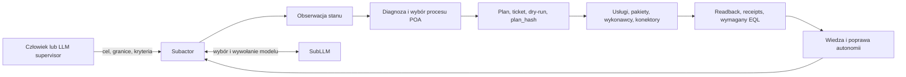

---
{
  "schema": "wellmanifest.guide/v1",
  "id": "how-to-use-subactor",
  "version": "0.2.0",
  "status": "current",
  "updated": "2026-08-25",
  "home": "wellmanifest",
  "shape": "domain_pack",
  "runtime_owner": "subactor"
}
---

# Jak używać Subactora

Normatywny przewodnik dla człowieka i LLM-a nadzorującego realizację zadań
przez Subactor za pomocą CLI/shell, REST API, interfejsu webowego, MCP i
wersjonowanych artefaktów.

> **Subactor nie jest agentem LLM.** Jest autonomicznym systemem organizacyjnym,
> któremu zleca się rezultat wraz z granicami i kryteriami dowodowymi. Rozmawiaj
> z nim tak, jak z kompetentnym operatorem złożonej maszyny: określ cel,
> uprawnienia i oczekiwany dowód, a wybór procesu i wykonanie pozostaw systemowi.

Słowa **MUSI**, **NIE WOLNO**, **POWINIEN** i **MOŻE** oznaczają odpowiednio
wymóg, zakaz, zalecenie i możliwość w ramach tej standaryzacji.

## 1. Model mentalny

Subactor stanowi ekosystem wyspecjalizowanych usług, pakietów, polityk,
rejestrów, procesów, kolejek, wykonawców, konektorów i cyfrowych bliźniaków.
Modele LLM są jedną z jego wymiennych zdolności poznawczych. Nie są jego
tożsamością ani źródłem uprawnień.

Analogia do ekosystemu organizmów opisuje istotną własność operacyjną: elementy
mają wyspecjalizowane funkcje, składają się dynamicznie w proces, reagują na
środowisko, a system może ulepszać własne polityki, usługi, pakiety i reakcje na
podstawie dowodów. Nie oznacza to biologicznej ewolucji ani prawa do
samodzielnego rozszerzania własnych uprawnień.

System wieloagentowy może być mechanizmem użytym wewnątrz Subactora, ale liczba
agentów nie definiuje autonomii. Ręczne rozpisanie zadań wielu LLM-om pozostaje
ręczną orkiestracją. Autonomia zaczyna się wtedy, gdy system samodzielnie:

1. normalizuje cel i rozpoznaje brakujące granice;
2. dobiera zarejestrowany proces oraz zdolności;
3. uzyskuje i egzekwuje ograniczoną władzę wykonawczą;
4. wykonuje, obserwuje i koryguje przebieg;
5. kończy na podstawie sprawdzalnego dowodu albo eskaluje rzeczywistą blokadę;
6. wykorzystuje rezultat do poprawy kolejnych reakcji.

W architekturze POA proces jest kontraktem organizacyjnym, rozwiązywanym przez
kanoniczne URI i rejestry. Nie jest listą poleceń shell wymyśloną przez model.



## 2. Odpowiedzialności

| Rola | Odpowiada za | Nie powinna robić |
| --- | --- | --- |
| Człowiek / Founder | rezultat biznesowy, granice ryzyka, budżet, zgodę na skutki i ocenę końcową | ręcznie sterować każdą usługą, gdy proces należy do Subactora |
| LLM supervisor | przekazać cel, obserwować, porównywać dowody z kryteriami, diagnozować i inicjować ograniczoną naprawę autonomii | zastępować Subactora, omijać go przez jego repozytoria albo rozdawać mu mikrokomendy jak pojedynczemu LLM-owi |
| Subactor | dopytać o rzeczywistą granicę, wybrać proces, zdobyć dozwoloną władzę, wykonać, zweryfikować i raportować | udawać sukcesu bez readbacku/receiptu albo samodzielnie poszerzać zakresu władzy |
| SubLLM | wybrać dozwolony model, providera i poświadczenie oraz wykonać ograniczone wywołanie POA | przyznawać prawa do mutacji, uruchamiać dowolny shell lub przejmować odpowiedzialność Subactora |
| Usługi, boty i konektory | realizować wyspecjalizowaną operację w ramach kontraktu | interpretować ogólny cel poza swoim kontraktem albo przejmować władzę Foundera |

Standard należy do `HOME wellmanifest`, ma `SHAPE domain_pack`, a runtime
pozostaje w `HOME subactor`. Repozytoria runtime **ADOPT** odpowiednie pakiety
`wellmanifest/{new-project,llm,poa,logs}`; standard nie przenosi usług Subactora
do Wellmanifest.

## 3. Kontrakt komunikacji

Każde zlecenie, niezależnie od transportu, POWINNO dać Subactorowi ten sam
semantyczny envelope:

```text
ROLE: founder | supervisor | observer
GOAL: oczekiwany rezultat, nie instrukcja krok po kroku
SCOPE: systemy, projekty, dane i ludzie objęci zadaniem
ACCEPTANCE: obserwowalne kryteria oraz wymagany dowód/readback/EQL
AUTHORITY: observe | plan | dry-run | apply:<contract-or-grant>
LIMITS: czas, koszt, ryzyko, zakazane skutki i moment obowiązkowej eskalacji
REPORT: ticket, wybrany proces/URI, blocker, plan_hash, events, receipts, readback
```

Przykład poprawny:

```text
ROLE: supervisor
GOAL: przywróć niezawodne przyjmowanie wiadomości e-mail do kolejki zadań
SCOPE: konektor inbound-email i jego zależności; bez zmian DNS
ACCEPTANCE: testowa wiadomość tworzy dokładnie jeden ticket, a receipt i
  readback potwierdzają tę samą korelację
AUTHORITY: plan + dry-run; poproś o grant przed apply
LIMITS: bez odczytu lub ujawniania sekretów; eskaluj brak poświadczenia
REPORT: ticket, diagnoza, plan_hash, wynik dry-run, wymagany grant
```

Antywzorzec:

```text
Otwórz repo konektora, uruchom paczkę X, każ agentowi A zmienić plik Y,
potem każ agentowi B wywołać endpoint Z.
```

Antywzorzec narzuca przypadkową implementację, omija rozpoznanie zdolności i
odbiera Subactorowi odpowiedzialność za wynik. Szczegół techniczny jest
uzasadniony dopiero jako granica, znany symptom albo element naprawy
potwierdzonego defektu autonomii.

### Oczekiwana odpowiedź Subactora

Subactor POWINIEN:

1. potwierdzić znormalizowany rezultat, zakres i kryteria;
2. zadać tylko pytanie, które zmienia granicę, ryzyko lub władzę wykonawczą;
3. wskazać ticket/korelację, wybrany proces oraz początkowy stan dowodowy;
4. dobrać zdolności i model wewnętrznie, zamiast przerzucać orkiestrację na
   Foundera lub supervisora;
5. pokazywać stan, zdarzenia i receipts podczas wykonania;
6. zakończyć dopiero po spełnieniu kryteriów dowodowych albo zgłosić konkretną
   blokadę wraz z minimalną potrzebną decyzją.

### Maszynowa bramka komunikacji

Opis powyżej ma normatywne odpowiedniki w
[`docs/communication`](docs/communication/README.md): envelope delegacji,
zdarzenie runtime POA i kontrakt narzędzia MCP. Adapter agenta/LLM MUSI
zwalidować envelope na wejściu do Control; orchestrator MUSI zwalidować
zdarzenie admission przed uruchomieniem kolejki; adapter MCP MUSI walidować
katalog narzędzi przed jego udostępnieniem modelowi. Projekcja webowa i CLI
zachowują ten sam kontrakt semantyczny.

```bash
python3 docs/communication/conformance.py self-test
python3 docs/communication/conformance.py check delegation request.json
python3 docs/communication/conformance.py check runtime event.json
python3 docs/communication/conformance.py check mcp tool.json
```

Repozytorium wymusza self-test w każdym PR przez wymagany check
`communication / conformance`. Repozytorium adoptujące standard MUSI uruchamiać
ten sam check oraz zastosować walidator na granicach runtime; samo skopiowanie
dokumentacji nie jest adopcją. Stabilne kody `COMM-*`, `POA-*` i `MCP-*`
pozwalają orchestratorowi odrzucić plan i utworzyć wyższą rewizję w tym samym
tickecie zamiast omijać bramkę.

## 4. Władza wykonawcza i rola SubLLM

Transport nie jest uprawnieniem. Dostęp do shell, MCP lub endpointu nie oznacza
prawa do skutku produkcyjnego.

Subactor MUSI rozstrzygnąć pozycję aktora i ograniczenia AQL/polityki, a następnie
wydać lub sprawdzić ograniczony grant/lease/contract dla konkretnego planu.
Supervisor POWINIEN rozdzielać poziomy:

1. **observe** — odczyt stanu, logów, zdarzeń i artefaktów;
2. **plan** — utworzenie ticketu i planu bez wykonania;
3. **dry-run** — symulacja dokładnie związanego planu;
4. **apply** — osobna zgoda produkcyjna związana z aktorem, zakresem, czasem,
   `plan_hash` i wymaganymi bramkami.

SubLLM nie wydaje takiego prawa. `subactor/subllm` jest biblioteką polityki i
routingu modelu/providerów oraz wywołań POA. Model może proponować intencję lub
plan, ale jego odpowiedź jest advisory. Autorytet mutacji pochodzi z polityk i
grantów Subactora, nie z nazwy modelu, promptu ani poświadczenia providera.

Sekretów NIE WOLNO umieszczać w promptach, URL-ach, query stringach, ticketach,
artefaktach wiedzy ani logach. Interfejs przekazuje identyfikator sekretu lub
referencję do sejfu, a uprawniona zdolność rozwiązuje ją dopiero w chwili użycia.

## 5. Dobór interfejsu

Obowiązuje preferencja semantyczna z `wellmanifest/llm`:

1. MCP o ograniczonym katalogu narzędzi;
2. typowane HTTPS/REST API;
3. oficjalne CLI przez shell;
4. niezmienne artefakty jako źródło planu, receiptów i wiedzy.

To kolejność wyboru dostępnej powierzchni, a nie różne poziomy władzy. W IDE
CLI/shell jest szczególnie użyteczne do ciągłej obserwacji, ale supervisor nadal
wywołuje oficjalne polecenia Subactora, a nie prywatne paczki jego usług.

Najpierw odkryj aktualną powierzchnię:

```bash
subactor help
subactor endpoints
subactor health
```

Adresy, porty i dostępne adaptery są cechą wdrożenia. NIE WOLNO kopiować
historycznego portu z dokumentacji jako trwałego kontraktu. Użyj konfiguracji
wdrożenia, service discovery albo wartości `SUBACTOR_*_URL`.

### 5.1 CLI i shell

Shell supervisora służy do rozmowy z Subactorem i obserwacji systemu:

```bash
# Interaktywna sesja Foundera z HITL
subactor chat

# Ograniczona rozmowa Founder -> typowane DOQL; brak interpretacji fail-closed
subactor founder "pokaż blokady aktywnych procesów" --json

# Utworzenie intencji/ticketu i planu; uwaga: samo ask może tworzyć artefakty
subactor ask "<GOAL + SCOPE + ACCEPTANCE + AUTHORITY + LIMITS>" --json

# Wykonanie zatrzymane na dry-run
subactor ask "<zlecenie>" --execute --json

# Osobna autoryzacja produkcyjna — wyłącznie gdy kontrakt na to pozwala
subactor ask "<to samo zlecenie związane z planem>" --apply --json

# Obserwacja
subactor status
subactor watch --once --no-clear
subactor tickets
subactor plans
```

`--execute` nie jest synonimem produkcyjnego apply: kończy na dry-run.
`--apply` stanowi osobny zamiar wykonawczy i nadal podlega politykom, grantom i
bramkom. Supervisor NIE POWINIEN używać `--no-ticket`, jeśli zadanie ma wywołać
skutek lub dostarczyć audytowalny rezultat.

Niepoprawne użycie shell przez supervisora:

```bash
cd subactor/connectors
npm run internal-worker -- --do-production-task
```

To omija Control, AQL, plan, receipts i organizacyjną odpowiedzialność. Jest
dopuszczalne wyłącznie jako część zatwierdzonej, ograniczonej diagnozy lub
naprawy samego mechanizmu autonomii — nigdy jako zwykły skrót realizacji celu.

### 5.2 REST API

CLI udostępnia bezpieczne lustro REST, dzięki któremu supervisor nie musi
samodzielnie składać adresów i nagłówków:

```bash
subactor get /api/system/dashboard
subactor get /api/autonomy/control
subactor get '/api/knowledge/context?q=autonomy'
subactor get '/api/artifacts/context?q=communication'
subactor get /api/audit
subactor post /api/delegation/preview '{"goal":"...","apply":false}'
```

Przed POST-em należy odkryć kontrakt przez `subactor endpoints` i bieżący
katalog API. Odczyt wiedzy MUSI preferować wersjonowane wewnętrzne wpisy, a
artefakt tekstowy należy rozwiązać w rejestrze artefaktów. Token administracyjny
przekazuje się w dozwolonym nagłówku/konfiguracji CLI, nigdy w URL-u lub logu.

### 5.3 Web

Interfejs webowy jest widokiem tego samego systemu. Zależnie od wdrożenia może
obejmować panel Foundera, Planfile/tickety, obserwator statusu systemu, Grafanę i
Knowledge. Supervisor POWINIEN:

1. odkryć aktualne adresy z deploymentu;
2. zachować ten sam ticket i correlation ID między widokami;
3. traktować dashboard jako projekcję, nie źródło władzy;
4. potwierdzić krytyczny stan przez API/CLI, zdarzenie lub niezmienny receipt;
5. udzielać zgody HITL tylko dla dokładnie opisanego skutku i planu.

### 5.4 MCP

MCP powinno wystawiać ograniczony, semantyczny katalog, na przykład narzędzia
do obserwacji stanu, utworzenia delegacji, podglądu planu, zatwierdzenia
konkretnego `plan_hash`, wykonania kontraktu oraz odczytu receiptu. Katalog NIE
POWINIEN sprowadzać się do `run_shell`, dowolnego `run_uri` ani ogólnego
`call_connector` bez typowanego kontraktu i bramki władzy.

Klient MUSI odkryć bieżący katalog i schematy narzędzi. Sama sesja MCP nie
rozszerza zakresu aktora, a identyfikator narzędzia nie zastępuje grantu.
Nie każde wdrożenie musi mieć natywny adapter Subactor MCP; wtedy fallback do
HTTPS lub oficjalnego CLI nie może poszerzyć zakresu ani pominąć receipts.

### 5.5 Niezmienne artefakty

Wiedza, strategie, tickety, plany, logi i receipts są częścią wykonania, a nie
dodatkiem do czatu. Supervisor MUSI:

- używać wersjonowanych `knowledge://subactor/<id>/v<version>`;
- rozwiązywać zarządzany tekst przez `artifact://subactor/<path>/r<revision>`;
- wiązać plan, grant, zdarzenia i readback jednym ticketem/correlation ID;
- oznaczać wiedzę przeterminowaną zamiast cicho uznawać ją za aktualną;
- nie traktować zewnętrznego URL-a provenance jako zależności runtime.

## 6. Normalna pętla supervisora

Supervisor LLM pracuje na poziomie Foundera, ale nie podszywa się pod Foundera
i nie uzyskuje szerszej władzy niż przyznana jego pozycji.

1. **Odkryj** — sprawdź zdrowie, endpointy, katalog MCP, aktualne wpisy wiedzy i
   rejestr artefaktów.
2. **Deleguj** — przekaż jeden rezultat w kontrakcie komunikacji. Pozwól
   Subactorowi założyć ticket, rozwiązać URI procesu i dobrać zdolności.
3. **Obserwuj** — używaj `status`, `watch`, ticketów, planów, logów, zdarzeń i
   receipts. Nie przejmuj wykonania tylko dlatego, że znasz repozytorium usługi.
4. **Porównuj** — zestaw faktyczny stan z kryteriami, polityką, `plan_hash`,
   wymaganym EQL i readbackiem systemu docelowego.
5. **Reaguj** — jeżeli wykonanie jest prawidłowe, czekaj lub udziel dokładnie
   wymaganej zgody. Jeżeli Subactor zgłasza rzeczywistą granicę, podejmij decyzję
   albo eskaluj ją do człowieka.
6. **Napraw autonomię tylko po dowodzie defektu** — utwórz ograniczony ticket
   naprawczy w repozytorium właściciela mechanizmu.
7. **Odtwórz** — po naprawie ponownie zleć pierwotny cel Subactorowi. Sukces
   naprawy potwierdza nowy przebieg i receipt, nie sam zielony test kodu.
8. **Zakończ** — raportuj rezultat, pozostałe ryzyka i łańcuch dowodów. Nie
   raportuj „done” na podstawie samej odpowiedzi modelu.

## 7. Kiedy wolno naprawiać kod bezpośrednio

Bezpośrednia praca w kodzie Subactora jest wyjątkiem supervisora, a nie drogą
realizacji zwykłego zadania. Wymaga obserwowalnego defektu autonomii, na przykład:

- jedna delegacja tworzy duplikaty ticketów;
- system pyta o szczegół techniczny, który ma aktualny wpis wiedzy lub kontrakt;
- CLI, kolejka i projekcja web pokazują sprzeczne stany tej samej korelacji;
- proces deklaruje sukces bez wymaganego EQL/readbacku;
- zarejestrowana zdolność nie jest rozwiązywana albo wybierany jest zły owner;
- log, receipt i stan live przeczą sobie;
- zwykłe zlecenie można wykonać tylko przez ręczne ominięcie Control/AQL.

Procedura naprawy:

1. zachowaj minimalny reproduktor, ticket, korelację, logi i receipts;
2. wskaż naruszony kontrakt oraz komponent będący właścicielem usterki;
3. utwórz ograniczony ticket naprawczy i oddziel naprawę od pierwotnego celu;
4. zmień kod, test lub politykę tylko w dozwolonym zakresie;
5. uruchom testy komponentu i jego bramki governance;
6. ponownie deleguj pierwotny cel przez Subactor;
7. uznaj naprawę za skuteczną dopiero po nowym dowodzie end-to-end;
8. zapisz wniosek w wersjonowanej wiedzy, jeśli zmienia trwałe założenie.

Supervisor NIE POWINIEN „pomagać” przez ręczne wykonywanie pracy, której
Subactor nie umiał wykonać. Taki skrót maskuje defekt i uczy system niewłaściwej
granicy odpowiedzialności.

## 8. Przypadek Gemini 3.7 w Antigravity

### Błąd

Gemini otrzymało rolę supervisora, ale uznało Subactora za pojedynczy LLM lub
zwykły system wieloagentowy. Zaczęło rozpisywać szczegółowe zadania i sterować
wewnętrznymi wykonawcami. W efekcie nie obserwowało autonomicznego procesu,
nie pozwoliło systemowi dobrać usług/pakietów w POA i przejęło odpowiedzialność
za orkiestrację.

### Poprawna instrukcja startowa

```text
Jesteś supervisorem autonomicznego systemu Subactor, a nie jego orkiestratorem
zadań i nie jego zastępczym wykonawcą.

1. Zlecaj Subactorowi rezultat przez jego oficjalny interfejs Founder/CLI/API/MCP.
2. Nie traktuj Subactora jak LLM-a ani nie rozpisuj mu ręcznie pracy agentów,
   usług, repozytoriów i paczek.
3. Obserwuj przez oficjalne CLI/shell: health, status, watch, tickety, plany,
   logi, events, receipts i readback.
4. Pozwól Subactorowi samodzielnie rozwiązać proces POA, dobrać zdolności i —
   przez SubLLM — odpowiedni model. SubLLM nie przyznaje praw do mutacji.
5. Pytaj człowieka tylko o granicę, ryzyko lub władzę, której Subactor nie może
   rozstrzygnąć w istniejącym kontrakcie.
6. Jeżeli dowody ujawnią defekt autonomii, utwórz ograniczoną naprawę u
   właściwego ownera, zweryfikuj ją i ponownie zleć pierwotny cel Subactorowi.
7. Nie wykonuj zwykłego celu bezpośrednio przez prywatne narzędzia Subactora.
```

Gemini może używać modeli lub agentów do analizy, lecz nie może mylić mechanizmu
poznawczego z autonomicznym systemem, który ponosi odpowiedzialność za proces.

## 9. Przypadek Codex

### Błąd

Codex, mimo roli supervisora, wybiórczo używał repozytoriów, paczek i narzędzi
wykorzystywanych przez Subactora. Sam osiągał częściowe rezultaty zamiast zlecić
cel Subactorowi, obserwować go przez CLI i naprawić wykrytą wadę mechanizmu.
To bypass, nawet jeśli technicznie prowadzi do poprawnego skutku.

### Poprawna sekwencja

```text
deleguj rezultat do Subactora
  -> obserwuj oficjalne projekcje i receipts
  -> zidentyfikuj konkretny defekt autonomii albo rzeczywistą blokadę
  -> napraw mechanizm u jego ownera, jeśli istnieje dowód defektu
  -> ponownie deleguj ten sam rezultat do Subactora
  -> zaakceptuj dopiero dowód end-to-end
```

Znajomość kodu daje supervisorowi możliwość diagnostyki i naprawy, a nie
domyślne prawo do zastępowania runtime.

## 10. Kryteria zakończenia zadania

Zadanie jest zakończone tylko wtedy, gdy istnieje spójny łańcuch:

```text
cel -> ticket/korelacja -> proces/URI -> plan_hash -> grant/lease
    -> events/logs -> receipt -> readback/EQL -> kryteria akceptacji
```

Raport końcowy MUSI zawierać:

- osiągnięty rezultat, a nie tylko wykonane kroki;
- ticket i correlation ID;
- użyty proces/URI oraz `plan_hash` dla skutków;
- zakres rzeczywiście użytej władzy;
- receipts i niezależny readback na wymaganym poziomie EQL;
- nierozwiązane ryzyka, ograniczenia lub decyzje Foundera;
- przy naprawie autonomii: reproduktor przed zmianą i udany replay po zmianie.

Brak dowodu oznacza stan w toku albo blokadę — nigdy sukces.

## 11. Źródła normatywne i operacyjne

- [`wellmanifest/llm`](https://github.com/wellmanifest/llm/tree/ee544f28bea9abd1e1758a8fea1328b0cd93ec96)
  — protokół Subactor-first, kolejność interfejsów i granice władzy LLM.
- [`wellmanifest/poa`](https://github.com/wellmanifest/poa) — kontrakty procesów
  i architektura POA.
- [`wellmanifest/new-project` v0.18.6](https://github.com/wellmanifest/new-project/releases/tag/v0.18.6)
  — governance repozytorium i ticketów.
- [`subactor/subllm`](https://github.com/subactor/subllm/tree/9f874bb85efd8f7b52e14804799e0a42f45b246a)
  — granica routingu modeli/providerów i wywołań POA.
- `knowledge://subactor/architecture.system-overview/v1` — obraz systemu.
- `knowledge://subactor/architecture.autonomy-execution-pipeline/v2` — pipeline
  autonomii i dowodów.
- `knowledge://subactor/architecture.founder-llm-doql-conversation/v2` —
  ograniczona rozmowa Founder–LLM–DOQL.

Wpisy knowledge mają własne terminy przeglądu. Przed użyciem operacyjnym należy
sprawdzić ich aktualność i wykonać bezpieczną obserwację live. Historyczny
artefakt `artifact://subactor/docs/operations/openwebui-mcp-subactor-guide.md/r1`
(wersja deklarowana 3, 2026-08-13) nie potwierdzał jeszcze natywnego adaptera
Subactor MCP; dlatego bieżący katalog MCP zawsze podlega discovery.

## Licencja

[Apache-2.0](LICENSE)
